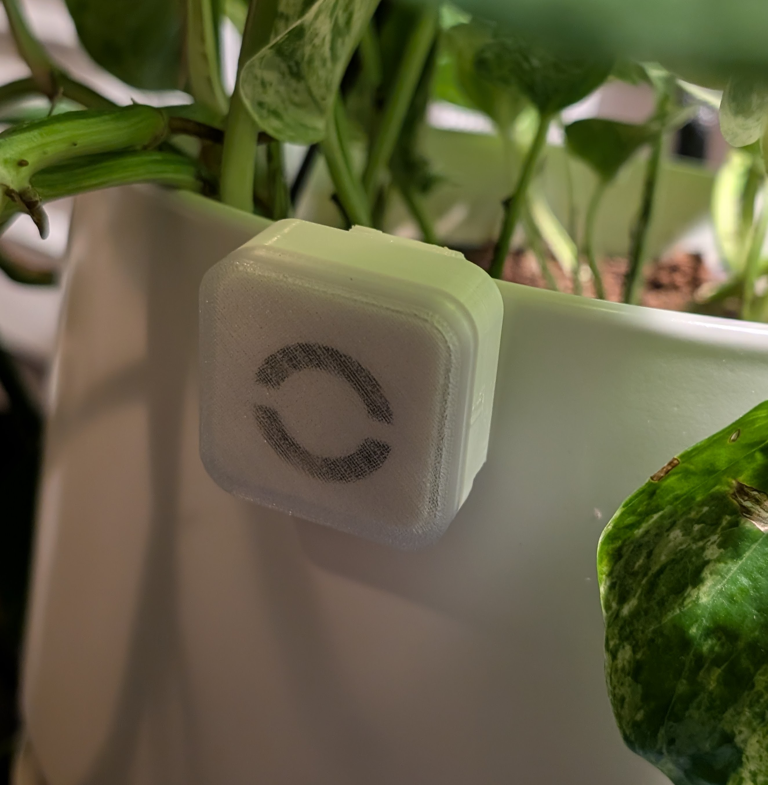

# Water timer




CC-BY-4.0. Copyright (c) 2026 Atelier Lelu.

A small device to remind you to water a plant. Battery powered but it lasts years. That's it.

An article about the project is at <https://lelu.uk/water-timer/>.

## How to use

Once assembled, enter setup mode to configure how often it waits before blinks (1, 3 or 7 days) by long pressing the top right button for 1.5 seconds. When you release you can cycle through durations by pressing the centre button - green LEDs will blink once (for 1 day), 3 times (for 3 days) or a long blink for 7 days. It auto saves after 10 seconds.
Once the 1/3/7 days have passed, the device will blink green every minute (twice) to remind you to water the plant. Once watered press the centre button once, green LEDs flash as acknowledgement and that's it.
When the battery is low the red light will flash on button presses of when watering is due - but it should take years before you reach that point.

## In this repository

| Path | What it is |
| --- | --- |
| `enclosure/print/` | STLs to print: back, front, light mask, hook |
| `enclosure/source/` | Matching STEP files, for editing |
| `hardware/` | KiCad project, plus the JLCPCB gerbers, BOM and placement file |
| `firmware/` | Plant-timer firmware, flash and test tools |
| `docs/` | Documentation |

## Make one

Print the four STLs, order the board, solder the coin-cell holder, flash the firmware, then close the case. The steps, including which jumper to close for a cell-powered timer, are in [docs/build.md](docs/build.md).

Flash before the board goes into the case. From `firmware/`:

```bash
make
make flash
```

Leave the option bytes alone. Programmer wiring and the button and LED behaviour are in [firmware/README.md](firmware/README.md).

Assembly, in order: hook, cell, board on the alignment pins, light mask, front. There are no screws. The picture is [docs/exploded.png](docs/exploded.png).

## License

Three licenses, one per kind of file. See [LICENSE.md](LICENSE.md). Hardware is CERN-OHL-P-2.0, firmware is MIT, and the documents are CC-BY-4.0. The ST files under `firmware/Drivers/` stay BSD-3-Clause.
