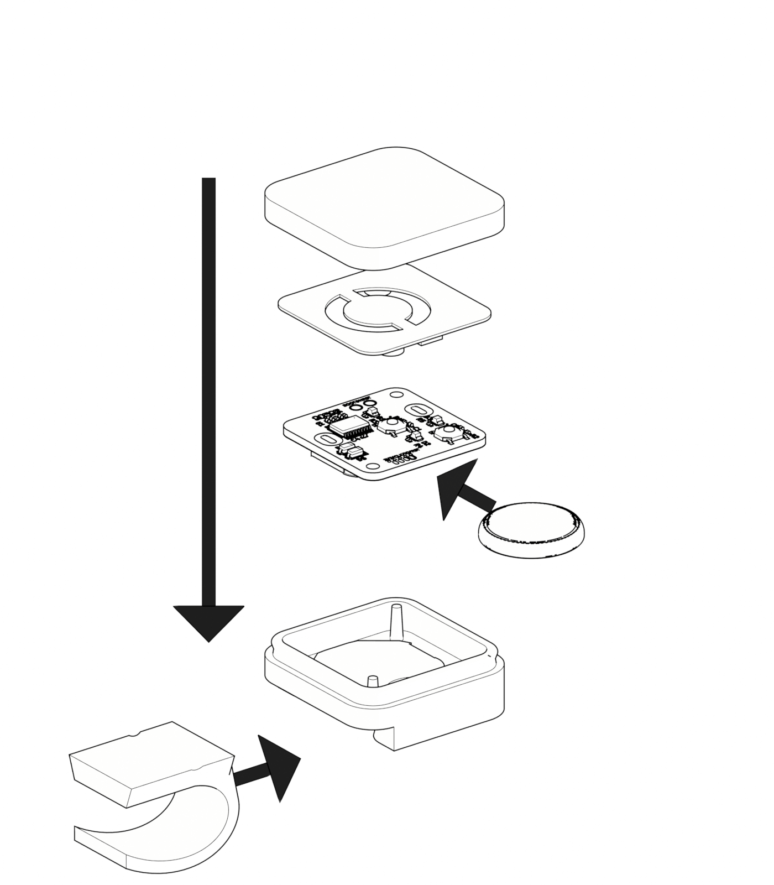

# Build

CC-BY-4.0. Copyright (c) 2026 Atelier Lelu.

The water timer is made of a printed case, a PCB, a coin-cell holder you solder yourself, a CR2032, and the firmware in `firmware/`.

## Print

0.2 mm layers, 0.4 mm nozzle. Back, light mask, and hook in white PETG. PLA is fine for those three. The front is translucent PETG.

| File | Part |
| --- | --- |
| `enclosure/print/case_back.stl` | Back with alignment pins |
| `enclosure/print/case_front.stl` | Front cover (translucent) |
| `enclosure/print/light_mask.stl` | Mask over the LEDs |
| `enclosure/print/slide_in_hook.stl` | Hook that slides into the back |

The matching STEP files in `enclosure/source/` are the ones to edit.

## Board

Order from `hardware/jlcpcb/production_files/`:

- `GERBER-water_timer_revB.zip`
- `BOM-water_timer_revB.csv`
- `CPL-water_timer_revB.csv`

The KiCad project is `hardware/water_timer_revB.kicad_pro`.

The JLCPCB BOM does not include the coin-cell holder. Solder one yourself on `P1`. The schematic symbol on that reference is a connector; the footprint on the board is `BAT-TH_MY-2032-22`. Fit a CR2032 in that holder.

Two solder jumpers ship open:

| Jumper | Close it when |
| --- | --- |
| `JP1` | The timer runs from the coin cell. This bypasses the cell's Schottky |
| `JP2` | Leave open |

## Flash

I am using a custom SOIC-8 mousebite connector to connect to my ST-LINK. 
Flash the board before it goes into the case. From `firmware/`:

```bash
make
make flash
```

NRST is wired to the ST-LINK, so `make flash` connects under reset. Leave the option bytes alone. Details, UART wiring, and the bring-up image are in `firmware/README.md`.

## Case

1. Slide the hook into the back
2. Put the CR2032 in the holder
3. Sit the board on the alignment pins
4. Place the light mask over the LEDs
5. Close the front (snap fit)


